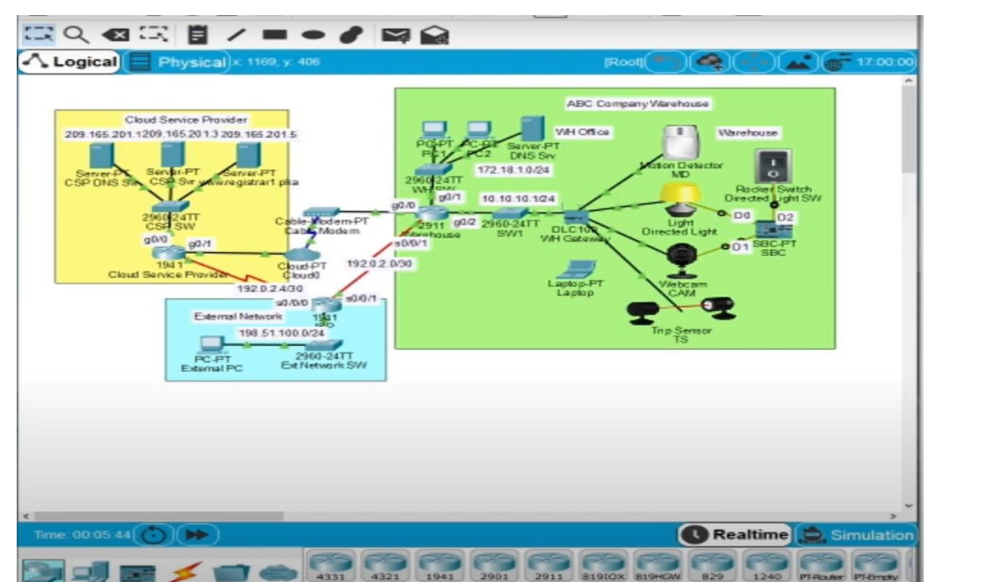

# SECURING CLOUD SERVICES IN IoT (using cisco packet tracer)

A Company is developing IoT system in their main warehouse. The objective is to deploy some physical security devices around the warehouse so that, when the warehouse is closed, these devices will monitor the doors and monitor the doors and windows. When an intruder is detected, the lights are turned on and web camera will start recording
The security is an important aspect in addition to the function of IoT system with cloud services..

## Modules Involved

-  Register IoT Devices to the Registration Server
-  Add Conditions in the Registration Server
-  Configure Strong Authentication to Network Devices
-  Configure Access Lists to Restrict Traffic between ABC Company IoT devices and the Cloud Service Provider Network
-  Configure Secure Web Communication to the Web Server in the Cloud Service Provider Network
-  Testing

## Cisco Packet Tracer Overview

Cisco Packet Tracer is a Cisco proprietary cross-platform tool that allows us
to create networks and simulate IoT without the need for pre-existing hardware or
networks.
This tool is free, works on major operating systems, and can be downloaded from
the Cisco NetAcad site  with a valid NetAcad account.

## Architecture Overview




## Methodology

### 1 . Register IoT Devices to the Registration Server
- Add a user to the registration server www.registrar1.pka with a strong password:
- Use a PC in the WH office. Under Desktop tab, open Web Browser, type www.registrar1.pka
  and select Go. The Registration Server Login window displays.
- Click Sign up now and create your own account with a strong password
- Register IoT devices to the registration server:
  Within the warehouse, click on Motion Detector. Under the Config tab, select Remote Server
  in the IoT Server section. Enter www.registrar1.pka as the server address and click Connect. Enter
  the username/password you just created.
- Repeat steps 1 and 2 to register the Light, Webcam, and Trip Sensor.
### 2. Add Conditions in the Registration Server
You will add conditions in the registration server so that when either the Motion Detector or Trip
Sensor is
activated, the directed light and the webcam are turned on.
Log in to the registration server using the username/password you created.
Click Conditions and add following three conditions:
- Name it LightsOn1, if MD status On is true, then set Directed Light status to On AND set CAM status On to true.
- Name it LightsOn2, if TS status On is true, then set Directed Light status to On AND set CAM status On to true.
- Name it LightsOff, if both MD status On is false AND TS status On is false, then set Directed Light status to Off AND set CAM status On to false.
- Test the conditions.
### 3. Configure Strong Authentication to Network Devices
You will configure strong authentication for a wireless connection on the WH gateway device:
-  Within the warehouse, click on the WH Gateway device. Under the Config tab, Wireless option,set the SSID to WhGateway1, set Authentication to WPA2-PSK with Pass Phrase as IoTWh001. Leave Encryption Type as AES.
-  Click on the Laptop. Under the Config tab, Wirel On the warehouse router, configure a banner to display a warning message for unlawful access. Although a banner message is not a security measure by itself, it may function as a deterrence to intruders. Set an encrypted password to enter the Exec mode. Set up a local user account for the console line and remote access.
1. Click the Warehouse 2911 router, then click the CLI tab and enter these commands:
```bash
Warehouse> enable
Warehouse# config terminal
Warehouse(config)# banner login %Login with valid password%
Warehouse(config)# banner motd %Authorized Access Only! Unauthorized access is
subject to Federal Prosecution.%
Warehouse(config)#
```
2.   Set a secure Exec mode password:
```bash
Warehouse(config)# enable secret AbcWh001
Warehouse(config)# exit
```
3. Set a local username for the console line and VTY lines access:
```bash
Warehouse# configure terminal
Warehouse(config)# username WhAdmin secret AbcLine001
Warehouse(config)# line console 0
Warehouse(config-line)# login local
Warehouse(config-line)# exit
Warehouse(config)# line vty 0 4
Warehouse(config-line)# login local
Warehouse(config-line)# end
Warehouse#
```
### 4. Configure Access Lists to Restrict Traffic between ABC Company IoT devices and the Cloud Service Provider Network
On the warehouse router, configure and apply access list 10 to allow traffic from only the DNS server
and the registration server to enter the ABC Company warehouse IoT devices network:
```bash
Warehouse# configure terminal
Warehouse(config)# access-list 10 permit host 172.18.1.5
Warehouse(config)# access-list 10 permit host 209.165.201.5
Warehouse(config)# interface g0/2
Warehouse(config-if)# ip access-group 10 out
Warehouse(config-if)# end
Warehouse#
```
On the Cloud Service Provider router, configure and apply an access list 110 to allow traffic from
only the ABC Company warehouse IoT devices network to access the registration server:
```bash
CSP# configure terminal
CSP(config)# access-list 110 permit ip host 209.165.200.226 host 209.165.201.5
CSP(config)# access-list 110 deny ip any host 209.165.201.5
CSP(config)# access-list 110 permit ip any any
CSP(config)# interface g0/0
CSP(config-if)# ip access-group 110 out
CSP(config-if)# end
```
### 5. Configure Secure Web Communication to the Web Server in the Cloud Service Provider Network
The ABC Company uses the web server in the cloud service provider for part of its operation.
Configure the web server in the cloud service provider network to be accessed only via HTTPS:
1. Click CSP Svr, then click the Services tab.
2. Click HTTP on the left pane. Make certain that HTTP is off and HTTPS is on.
